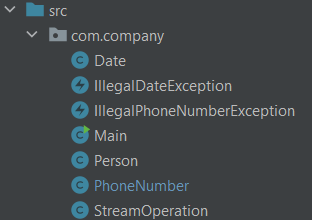

# Zweck des Programmes:
Es werden Informationen zu Person gespeichert. Außerdem wird überprüft ob diese Person eine gültig Telefonnummer besitzt. 
Es besteht aus 3 Hauptklassen:

- [PhoneNumber](phoneNumber.md) 
- [Date](date.md) 
- [Person](person.md) 

[Home](index.md)
